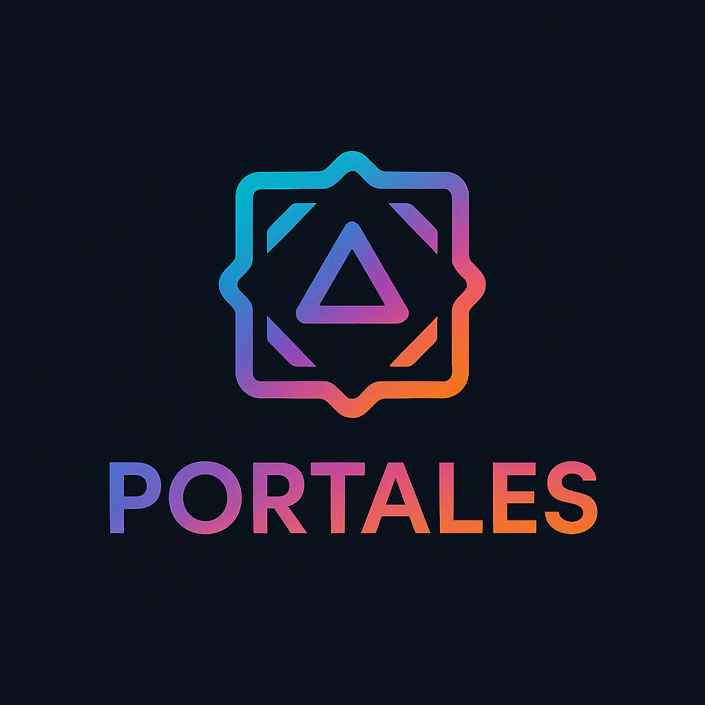

# PORTALES - Arte como Portal Digital



## Descrição do Projeto

O **PORTALES** é um aplicativo inovador que atua como uma ponte entre a arte física e o mundo digital, utilizando inteligência artificial e realidade aumentada. Ele permite que artistas e criadores transformem suas obras de arte em "portais digitais" interativos, que podem ser explorados por outros usuários através de um scanner de realidade aumentada. A plataforma oferece uma experiência imersiva e "tech-mística", onde o físico e o digital se conectam de forma fluida e intuitiva.

### Funcionalidades Principais:

- **Modo Criador**: Artistas podem fazer upload de suas obras e associá-las a conteúdos digitais (vídeos, áudios, NFTs, websites), criando portais únicos.
- **Modo Explorador**: Usuários podem escanear obras de arte físicas com a câmera do dispositivo para revelar os portais digitais ocultos e interagir com o conteúdo associado.
- **Marketplace**: Um espaço para descobrir e adquirir obras de arte digitais e físicas, incluindo NFTs.
- **Experiência Imersiva**: Design "tech-místico" com animações fluidas, partículas flutuantes e efeitos visuais que enriquecem a interação.

## Tecnologias Utilizadas

O projeto PORTALES é construído com as seguintes tecnologias:

- **Frontend**: React 19, React Native (para mobile), Vite (bundler), Tailwind CSS (estilização), Framer Motion (animações), React Router (navegação), React Query (gerenciamento de estado).
- **Backend**: Node.js / Python (com Express.js ou Flask/Django).
- **Banco de Dados**: PostgreSQL (relacional) e MongoDB (NoSQL).
- **Armazenamento**: Amazon S3 (ou similar) para mídias.
- **Autenticação**: JWT / OAuth 2.0.
- **CI/CD**: GitHub Actions, Lighthouse CI.

## Estrutura de Pastas

```
portales-app/
├── .github/
│   └── workflows/
│       └── ci-cd.yml          # Pipeline CI/CD
├── public/
│   └── favicon.ico
├── src/
│   ├── assets/
│   │   └── LOGO.png           # Logo do PORTALES
│   ├── components/
│   │   ├── ui/                # Componentes shadcn/ui
│   │   ├── CosmicLoader.jsx   # Loader animado
│   │   ├── FloatingParticles.jsx
│   │   ├── Navigation.jsx     # Navegação bottom
│   │   ├── PortalButton.jsx   # Botão customizado
│   │   └── PortalCard.jsx     # Card de portal
│   ├── hooks/
│   ├── lib/
│   │   └── utils.js
│   ├── App.css               # Estilos personalizados
│   ├── App.jsx               # Componente principal
│   ├── index.css             # Estilos globais
│   └── main.jsx              # Entry point
├── .gitignore
├── components.json           # Configuração shadcn/ui
├── eslint.config.js
├── index.html
├── jsconfig.json
├── lighthouserc.json         # Configuração Lighthouse CI
├── package.json
├── pnpm-lock.yaml
└── vite.config.js
```

## Instalação e Execução Local

Siga os passos abaixo para configurar e rodar o projeto em sua máquina local:

### Pré-requisitos

Certifique-se de ter o [Node.js](https://nodejs.org/en/) (versão 18.x ou superior) e o [pnpm](https://pnpm.io/installation) instalados.

```bash
# Instalar pnpm globalmente (se ainda não tiver)
npm install -g pnpm
```

### Passos

1.  **Clone o repositório** (ou extraia o arquivo do projeto):
    ```bash
    git clone https://github.com/GabrielJaccoud/portales-app.git
    cd portales-app
    ```

2.  **Instale as dependências**:
    ```bash
    pnpm install
    ```

3.  **Inicie o servidor de desenvolvimento**:
    ```bash
    pnpm run dev
    ```

    O aplicativo estará disponível em `http://localhost:5173/` (ou outra porta disponível).

## Comandos Disponíveis

No diretório do projeto, você pode executar os seguintes comandos:

- `pnpm run dev`: Inicia o servidor de desenvolvimento.
- `pnpm run build`: Compila o aplicativo para produção na pasta `dist/`.
- `pnpm run lint`: Executa o linter para verificar problemas de código.
- `pnpm run preview`: Serve o build de produção localmente para pré-visualização.
- `pnpm run test`: Executa os testes (se configurados).

## Links Úteis

- [Documentação React](https://react.dev/)
- [Documentação Vite](https://vitejs.dev/)
- [Documentação Tailwind CSS](https://tailwindcss.com/docs)
- [Documentação shadcn/ui](https://ui.shadcn.com/)
- [Documentação Framer Motion](https://www.framer.com/motion/)
- [Documentação Lucide React](https://lucide.dev/)
- [Documentação pnpm](https://pnpm.io/)
- [GitHub Actions Documentation](https://docs.github.com/en/actions)
- [Lighthouse CI Documentation](https://github.com/GoogleChrome/lighthouse-ci)

## Contribuição

Contribuições são bem-vindas! Por favor, siga as diretrizes de contribuição (a serem definidas) e o código de conduta.

## Licença

Este projeto está licenciado sob a Licença MIT. Veja o arquivo `LICENSE` para mais detalhes.

---

**Desenvolvido por Manus AI**

*Este README.md é um template. Sinta-se à vontade para expandi-lo com mais detalhes sobre o seu projeto, como diretrizes de contribuição, roadmap, etc.*

